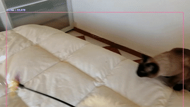

# Pet Detector :eye: :cat::dog::rabbit: :eye:



This project is part of the [**TabularConf2021**](https://github.com/tabularconf) conference and video (spanish version) of it can be seen [here](https://youtu.be/op5S6bpJBWA?t=8930). :warning: If you want to use the slides on your own project it will be great to let me know first :smile:.

## Introduction :nerd_face:

This project aims to show the **full pipeline** of how to develop an **object detector** focused **on animals**. The different stages are:

- Setting up the dev Environment.
- Gathering data to train on.
- Labeling the images for object detection with [labelImg](https://github.com/tzutalin/labelImg).
- Training the model with Yolov3 And [ImageAI](https://github.com/OlafenwaMoses/ImageAI).
- Evaluating the model and understanding what is the mAP.
- Using the model on real time with a camera.

To simplify the whole pipeline we use [ImageAI Library](https://github.com/OlafenwaMoses/ImageAI)


## How to run this project :hammer_and_wrench:

:warning: It is **highly recommended to have a GPU** to run the training and inference part of this code as CPU training can be potentially slow. :warning:


### Using Pyenv + Anaconda

If you've never used [Pyenv](https://github.com/pyenv/pyenv) I stronglly recommend you to use it as your local python environment manager, it supports virtualenv and anaconda. :thumbsup:

- [Install Pyenv](https://github.com/pyenv/pyenv#installation)


Once you have **installed Pyenv**:

1. **Download** this repo
```
git clone https://github.com/Matesanz/pet-detector.git
cd pet-detector
```

2. Install **anaconda3-2020.11**, create a conda environment,use it as your local python version and install dependencies
```
pyenv install anaconda3-2020.11
pyenv virtualenv anaconda3-2020.11 tf
pyenv local tf
conda env update -f environment.yml
```
If you do `conda list` you should see all the dependencies installed (such as *opencv==4.5*, *cuda-toolkit==11*, *cudnn=8.0.5* and *imageai==2.1.6*)

3. Download the **pretrained yolov3 weights**:
```
wget https://github.com/OlafenwaMoses/ImageAI/releases/download/essential-v4/pretrained-yolov3.h5
```

4. **Install** the conda env in jupyter and **run** the project:
```
python -m ipykernel install --user --name=pet-detection
jupyter notebook
```

**Done** :smile::thumbsup:, now you can start messing around!


# Stages :tada:

### 1. Data Collection

This is a **handmade step**, you should search for images that match the classes you want to train on. Places such as Kaggle and Google Open Images should fit for most common datasets. Inside the Jupyter notebook there is a script that helps you downloading images using the [google-images-download ](https://github.com/hardikvasa/google-images-download) library.

:warning: *note there is a limit of 100 images per tag when running the script*

### 2. Data labelling
Simply run on your terminal (inside the *tf* environment):

```
labelImg
```
Start labeling, more info on how to use **labelImg** can be found [here](https://github.com/tzutalin/labelImg).


### 3. Model training
Remember to store your images as shown in [here](https://github.com/OlafenwaMoses/ImageAI/blob/master/imageai/Detection/Custom/CUSTOMDETECTIONTRAINING.md). There is also an script inside the jupyter notebook showing how to do it. You can **check how the model training** is going by running this script in the terminal:

```
tensorboard tensorboard --logdir <path_to_your_dataset_folder>/logs
```

### 4. Model Evaluation
In object detection **mAP is used as a benchmark to study the model performance**. There is also an script inside the jupyter notebook showing how to get the model mAP.

### 5. Model Inference
There is an script inside the jupyter notebook showing how use your trained neural network to detect images on **real time**.
